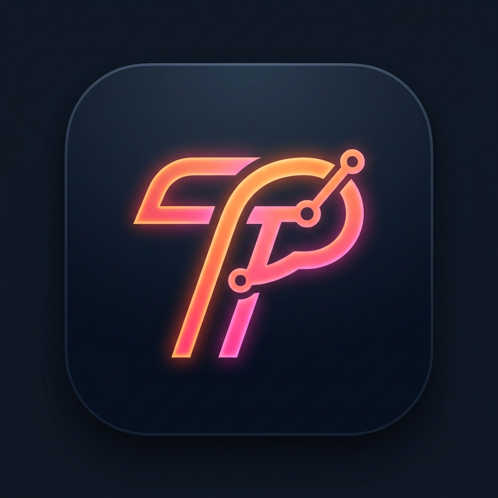
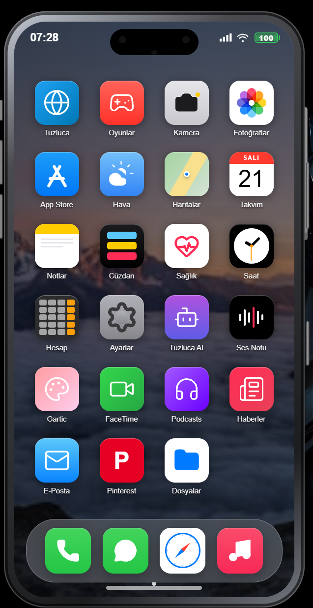
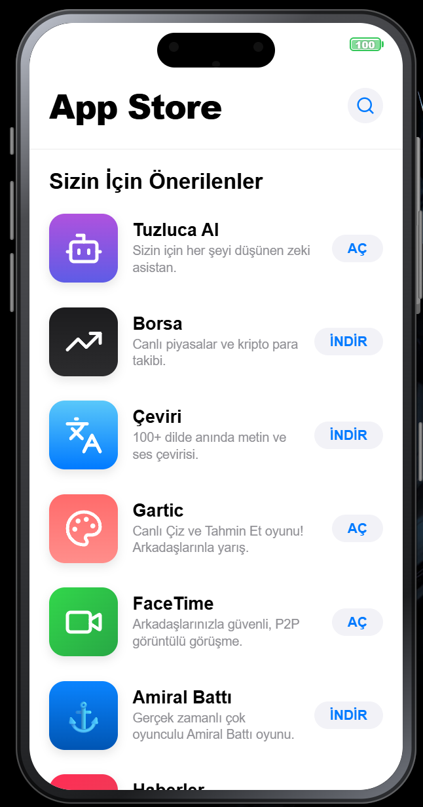
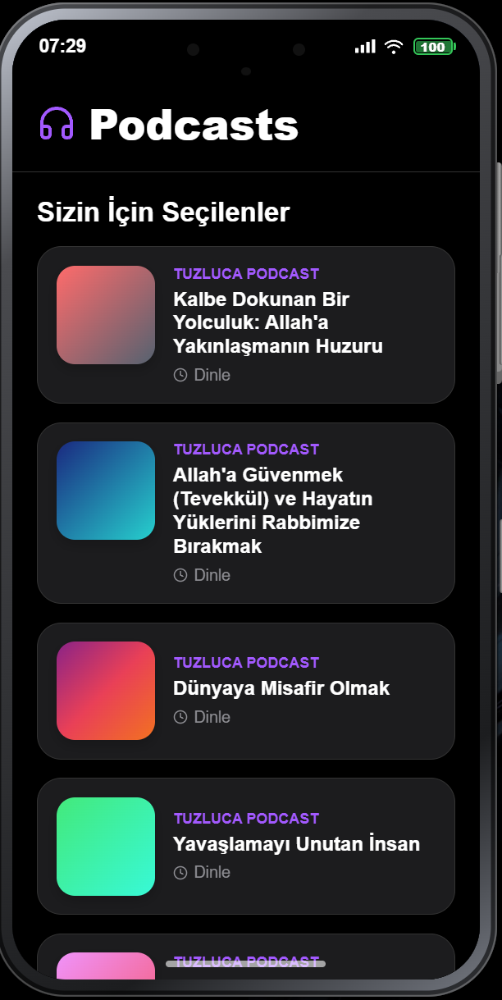
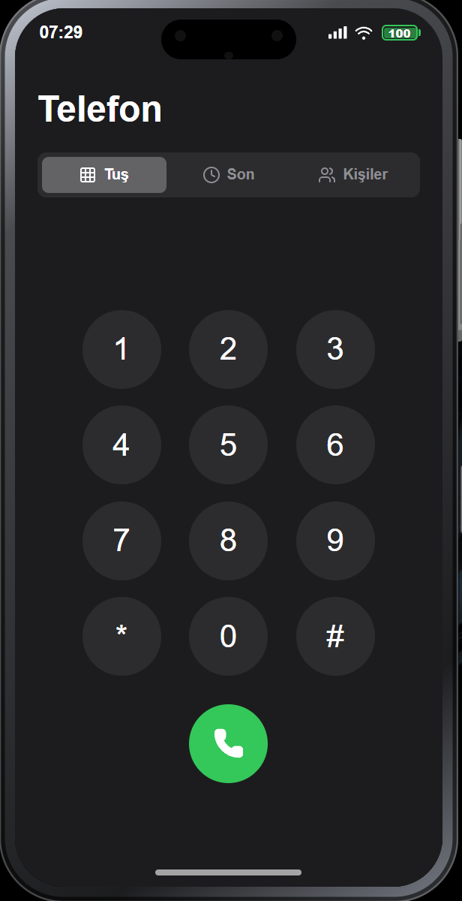
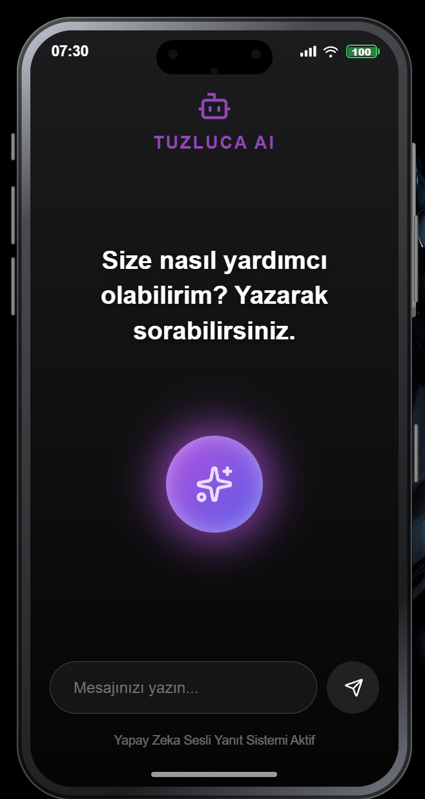
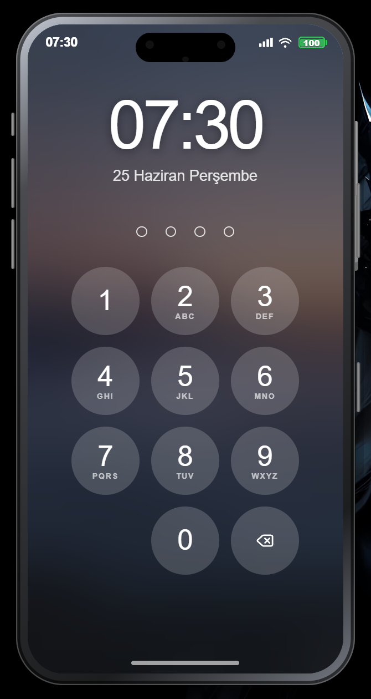

  
  <h1>Tuzluca OS</h1>
  
<strong>Modern, Web Tabanlı Bir Masaüstü İşletim Sistemi Konsepti</strong>

  
  
  
  

 

**Tuzluca OS**, web teknolojileri kullanılarak masaüstü bilgisayarlar için geliştirilmiş yenilikçi ve konsept bir işletim sistemidir. Kullanıcılara ekranlarında her an etkileşime girebilecekleri, şık, cam efektli (Glassmorphic) ve tamamen işlevsel bir sanal akıllı telefon/masaüstü deneyimi sunar. 

> ⚠️ **Uyarı:** Bu proje tamamen konsept ve kapalı kaynak (özel) bir geliştirme sürecine sahiptir. Kaynak kodlarının kişisel/ticari amaçlarla indirilip derlenmesi desteklenmemektedir. Sistemi denemek için **Releases** sekmesinden hazır kurulum dosyasını indirebilirsiniz.

---

## 🌟 Neler Sunuyor? (Özellikler & Uygulamalar)

Tuzluca OS sadece görsel bir arayüz değil, arka planda çalışan güçlü bir veritabanı altyapısıyla (Supabase) gerçek zamanlı bir ekosistemdir.

*   **📱 Sanal Akıllı Telefon Arayüzü:** Masaüstünüzde sürükleyip bırakabileceğiniz, ana işletim sisteminizle entegre çalışan şık bir telefon görünümü.
*   **🔔 Dinamik Ada & Masaüstü Bildirimleri:** Arka planda çalışırken mesaj veya bildirim geldiğinde Windows/Mac sisteminiz üzerinden veya telefon içi dinamik ada üzerinden anında haberdar olursunuz.
*   **💬 Kendi İçinde Mini Sosyal Medya & Mesajlaşma:** Sadece bu işletim sistemini kullanan kişilerin birbiriyle etkileşime geçebileceği, fotoğraf paylaşıp beğenebileceği ve anlık mesajlaşabileceği özgün "Social" altyapısı.
*   **⚙️ Kapsamlı Sistem Ayarları:** İşletim sisteminin duvar kağıdından ses tonlarına, gizlilik kilitlerinden bildirim yönetimlerine kadar cihazı tamamen kişiselleştirebileceğiniz gelişmiş "Ayarlar" menüsü.
*   **📞 Yüksek Kaliteli Sesli ve Görüntülü Sohbet:** Size özel atanan sanal numaranız sayesinde arkadaşlarınızla yüksek ses kalitesinde sohbet edebilir, FaceTime (Görüntülü Arama) görüşmeleri gerçekleştirebilirsiniz.
*   **📴 Offline-First (Çevrimdışı Çalışma):** İnternet bağlantınız koptuğunda veya bilgisayarı ilk açtığınızda sistem sizi dışarı atmaz. Yerel önbellek (Cache) üzerinden sizi saniyesinde sisteme dahil eder.
*   **🤖 Dinç Asistan (Yapay Zeka):** Sistem içi işlemleri, ayarları ve çevirileri yönetebilen akıllı sesli ve yazılı asistan.
*   **🧩 Kapsamlı Uygulama Paketi:** 
    *   **Haritalar:** Konum takibi ve gelişmiş harita servisi.
    *   **Hava Durumu:** Dinamik hava durumu arayüzü.
    *   **Mağaza & Cüzdan:** Uygulama içi satın alımlar ve puan sistemi.
    *   **Oyunlar:** Amiral Battı, Gartic gibi entegre mini oyunlar.
    *   **Araçlar:** Hesap Makinesi, Ses Kaydedici, Kamera, Dosya Yöneticisi, Notlar, Takvim ve Çeviri.

---

## 📥 Nasıl İndirilir ve Kurulur?

Sistemi kullanmak için kaynak kodlarını indirmenize gerek yoktur. Aşağıdaki adımları takip ederek doğrudan hazır programı kurabilirsiniz:

1. GitHub sayfasının sağ tarafında bulunan **[Releases (Sürümler)](https://github.com/alicantuzluca/Tuzluca-Social/releases)** bölümüne tıklayın.
2. En güncel sürümü (Örn: `v0.0.9`) seçin.
3. İndirilenler listesinden **`Tuzluca Social Setup.exe`** dosyasını bilgisayarınıza indirin.
4. Çift tıklayarak normal bir masaüstü uygulaması gibi kurun ve keyfini çıkarın!

---

## 📸 Ekran Görüntüleri

Aşağıda işletim sisteminin çeşitli modüllerinden kareler bulabilirsiniz:

### Kilit Ekranı ve Giriş (Karanlık Mod)

### İşletim Sistemi Ana Ekranı

### Uygulamalar Menüsü

### Gerçek Zamanlı Sosyal Akış

### Asistan ve Sistem Yönetimi

### Detaylı Görüntü

---

  Tuzluca Cloud Inc. tarafından özenle geliştirilmektedir. © 2026

